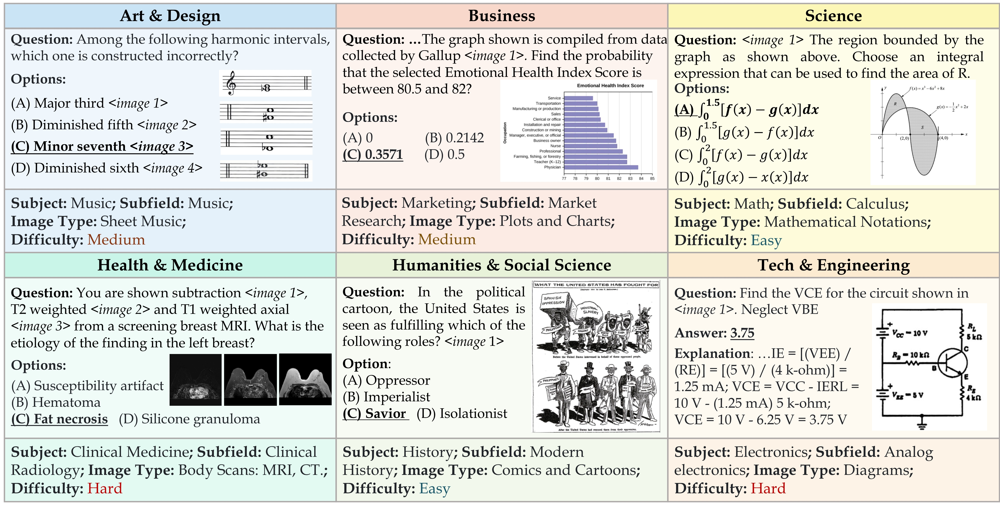

# MMMU 

[**🤗 Dataset**](https://arxiv.org/abs/XX) | [**📖 Paper**](https://arxiv.org/abs/XX) | [**GitHub**](https://github.com/MMMU-Benchmark/MMMU) | [**🌐 Homepage**](https://mmmu-benchmark.github.io/)


This repo contains evaluation code for the paper "MMMU: A Massive Multi-discipline Multimodal Understanding and Reasoning Benchmark for Expert AGI"


## Introduction
We introduce MMMU: a new benchmark designed to evaluate multimodal models on massive multi-discipline tasks demanding college-level subject knowledge and deliberate reasoning. MMMU includes **11.5K meticulously collected multimodal questions** from college exams, quizzes, and textbooks, covering six core disciplines: Art & Design, Business, Science, Health & Medicine, Humanities & Social Science, and Tech & Engineering. These questions span **30 subjects** and **183 subfields**, comprising **32 highly heterogeneous image types**, such as charts, diagrams, maps, tables, music sheets, and chemical structures. Unlike existing benchmarks, MMMU focuses on advanced perception and reasoning with domain-specific knowledge, challenging models to perform tasks akin to those faced by experts. Our evaluation of 14 open-source LMMs and the proprietary GPT-4V(ision) highlights the substantial challenges posed by MMMU. Even the advanced GPT-4V only achieves a 56% accuracy, indicating significant room for improvement. We believe MMMU will stimulate the community to build next-generation multimodal foundation models towards expert artificial general intelligence (AGI).



## Dataset Creation

MMMU was created to challenge multimodal models with tasks that demand college-level subject knowledge and deliberate reasoning, pushing the boundaries of what these models can achieve in terms of expert-level perception and reasoning. Please refer to our huggingface [**🤗 Dataset**](https://arxiv.org/abs/XX) for more details.

## Evaluation
Please refer to our [eval](eval)
 folder for more details.

## Mini-Leaderboard
| Model                      | Val (900) | Test (10.5K) |
|----------------------------|:---------:|:------------:|
| GPT-4V(ision) (Playground) |    **56.8**   |     **55.7**     |
| BLIP-2 FLAN-T5-XXL         |    35.4   |     34.0     |
| InstructBLIP-T5-XXL        |    35.7   |     33.8     |
| LLaVA-1.5-13B              |    36.4   |     33.6     |
| Qwen-VL-7B                 |    35.9   |     32.9     |
| BLIP-2 FLAN-T5-XL          |    34.4   |     31.0     |
| InstructBLIP-T5-XL         |    32.9   |     30.6     |
| CogVLM                     |    32.1   |     30.1     |
| Otter                      |    32.2   |     29.1     |
| LLaMA-Adapter2-7B          |    29.8   |     27.7     |
| MiniGPT4-Vicuna-13B        |    26.8   |     27.6     |
| Fuyu-8B                    |    27.9   |     27.4     |
| mPLUG-OWL2                 |    28.0   |     26.8     |
| Kosmos2                    |    24.4   |     26.6     |
| OpenFlamingo2-9B           |    28.7   |     26.3     |
| Frequent Choice            |    22.1   |     23.9     |
| Random Choice              |    26.8   |     25.8     |

**We only release the full set of 150 dev and 900 validation questions. The dev set can be used for few-shot / in-context learning and the validation set is used to debug models, select hyperparameters, have a quick evaluation, etc. We only release the questions in the test set but hide the answers and explanations. To submit your model’s prediction on the test set, please contact us. An automatic submission system and a leaderboard will be released very soon.**

To submit your model's performance on the leaderboard, please [contact](#contact) us.

## Disclaimers
The guidelines for the annotators emphasized strict compliance with copyright and licensing rules from the initial data source, specifically avoiding materials from websites that forbid copying and redistribution. 
Should you encounter any data samples potentially breaching the copyright or licensing regulations of any site, we encourage you to [contact](#contact) us. Upon verification, such samples will be promptly removed.

## Contact
- Xiang Yue: xiangyue@in.ai
- Yu Su: su.809@osu.edu
- Wenhu Chen: wenhuchen@uwaterloo.ca

## Citation

**BibTeX:**
```bibtex
@article{yue2023mmmu,
  title={MMMU: A Massive Multi-discipline Multimodal Understanding and Reasoning Benchmark for Expert AGI},
  author={Yue, Xiang and Ni, Yuansheng and Zhang, Kai and Zheng, Tianyu and Liu, Ruoqi and Zhang, Ge and Jiang, Dongfu and Ren, Weiming and Yang, Zhenzhu and Sun, Renliang and Zheng, Boyuan and Stevens, Samuel and Yuan, Ruibin and Yu, Botao and Sun, Yuxuan and Liu, Yibo and Wei, Cong and Yin, Ming and Huang, Wenhao and Sun, Huan and Su, Yu and Chen, Wenhu},
  journal={arXiv preprint Link},
  year={2023},
}
```
